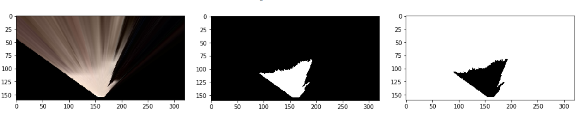

## Project: Search and Sample Return
### Project 1 For Udacity Robotics Nanodegree program

**Introduction**

The search and sample return project is based on the concept of a hypothetical rover mission. In the scenario, a rover is placed in a system of canyons along with obstacles and 'samples' that are represented by gold colored rocks. The contour of the canyon is closed (i.e. the environment is finite) and is pirmarily composed of 3 types of structures:

 * The canyon floor, which can best be described as (mostly) firm sand colored surface.
 * The canyon walls, which are typically angled away from teh floor at 10 - 20 degrees from the vertical and are primarily dark brown or black in color
 * The obsidian colored boulders placed in various areas, either as part of the canyon walls, or in the middle of the canyon floor.

The first goal of this project is to process the images from the camera on the front of the rover to both map the region and provide the navigation inputs to the rover. The second goal consists of modifying the existing rover logic so that the outputs (speed, direction) of the rover are correctly set based on the vision derived inputs to succssfully navigate the canyon environment. 

Minimum criteria for success are as follows:

 1. Map 40% or more of the environment 
 2. The map must have a fidelity of at least 60% (the map may contain no more than 40% of it's pixels that do not match the source of truth)
 3. The Rover must locate at least one of the sample rocks and map it.
 
 In addition to the minimum passing requiremenents, aspirational goals may include:
 
 4. Mapping to a higher fidelity.
 5. Develop capability for rover to autonomously correct when stuck.
 6. Picking up samples as well as locating them.
 7. Returning to the starting point once all the samples are collected.
 
For this submission, the minimum criteria were met, and an attepmt was made on the aspirational goals 4,5,6. An attempt was not made to return the rover back to its start position (#7).
 
 ### Vision/Perception steps (perception.py)
 
*Note that the steps below describe what was implemented in the perception.py module. [Notebook Analysis can be found here](Rover_Project_1)*

As mentioned above, the first goal for this project is to process the images for the front facing rover camera to extract mapping and navigational data. To do this, the following processing steps are applied to each image from the rover camera. The simulation was run on an Dell Lattitude E7420 on the 'Fastest' setting at resolution of 1360x768. Running the processing script in the Anaconda RoboND environment at these settings allowed between 17-24 images to be processed per second depending on the complexity of the image.

 ***Perform a perspective transform***
 
 The default image read in from the rover telemetry is taken from the POV of the front of the rover. To use the image for mapping the image would ideally be an isometric overhead projection. The OpenCV image processing library has two functions that can be utilized to transform the raw rover image into an isometric projectcion. The first function,[getPerspectiveTransform](https://docs.opencv.org/2.4/modules/imgproc/doc/geometric_transformations.html#getperspectivetransform) is used to determine the perspective transform, given 4 sets of coordinates that identify the same spatial locations in both the dessired source and destination.  image. Once the perspective transform is obtained, it can then be used to transform the images fed in from the rover telemetry using tje [warpPerspective function](https://docs.opencv.org/2.4/modules/imgproc/doc/geometric_transformations.html#warpperspective). An example of how this conceptually works (not to scale) is shown below:
 
 
 ```python
 
# 1) Define source and destination points for perspective transform
    source = np.float32([[13,140], [302,140], [200,96], [118,96]])  #four pixel coords from source image
    destination = np.float32([[155,155],[165,155],[165,145],[155,145]]) #four pixel coords from dest image
    
# 2) Apply perspective transform
    warped = perspect_transform(Rover.img, source, destination)
 
# Define a function to perform a perspective transform
def perspect_transform(img, src, dst):
           
    M = cv2.getPerspectiveTransform(src, dst)
    warped = cv2.warpPerspective(img, M, (img.shape[1], img.shape[0]))# keep same size as input image
    
    return warped
 ```
 
 ***Color Thresholding***
 
 Once the transformed (warped) image is obtained, the next step is to successfully determine the navigable / unavigable areas of the canyons. The approach used here was to use an rgb threshold to identify navigable pixels since the canyon floors are larglely a light color and the unavigable terrain is mostly dark in coloring. Good results were returned when using thresholds for red, green, blue of (190,180,160). The un-navigable terrain was assumed to be all the pixels that were not above the threshold. For identifying the gold sample rocks a slighly different approach needed to be used since a simple threshold could not be used to identify specific colors. This was addressed by adding the functionality to the color_thresh function to filter on pixels that were within a tolerance of a given color value. For the gold rocks rgb values of (185, 140, 15) with a tolerance of +/- 40 for each value to return true as a match. The images below represent the raw warped image, the initial thresholding step, and then the inverse step to identify obstacle pixels:
 
 

```python

    # 3) Apply color threshold to identify navigable terrain/obstacles/rock samples
    #GOLD ROCK ~ rgb = 189,144,19 --> 213,183,25 --> 255,219,54
    #OBSTACLES ~ rgb = 13,0,0
    nav_threshold = (190, 180, 160)
    tgt_threshold = (185, 140, 15)
    obs_threshold = (100, 100, 100)
    tgt_img = color_thresh(warped, tgt_threshold, tgt=True) # used for finding colored rocks
    obs_img = color_thresh(warped, obs_threshold) # used for finding obstacles
    
 def color_thresh(img, rgb_thresh=(160, 160, 160), tgt=False, tol=(40,40,40)):
    # img                  transformed (warped) camera image array
    # rgb_thresh           tgt==False (default) return array where > rgb_thresh = True (1)
    #                      tgt==True  return array where rgb_thresh +/- rgb_thresh * tol = True (1)
    # tol                  when tgt==True, sets the tolerance +/- for a pixel to return true
    
    # Create an array of zeros same xy size as img, but single channel
    color_select = np.zeros_like(img[:,:,0])
    
    # if tgt == True we are looking for samples so look for +/- from rgb_thresh
    if tgt:
        bool_array = (abs(img[:,:,0] - rgb_thresh[0]) < tol[0]) \
                   & (abs(img[:,:,1] - rgb_thresh[1]) < tol[1]) \
                   & (abs(img[:,:,2] - rgb_thresh[2]) < tol[2]) 
    
    # tgt is false, we are looking for nav terrain/obstacles
    else:    
        # Require that each pixel be above all three threshold values in RGB
        # above_thresh will now contain a boolean array with "True"
        # where threshold was met
        bool_array = (img[:,:,0] > rgb_thresh[0]) \
                   & (img[:,:,1] > rgb_thresh[1]) \
                   & (img[:,:,2] > rgb_thresh[2])
    # Index the array of zeros with the boolean array and set to 1
    color_select[bool_array] = 1
    # Return the binary image
    return color_select
``` 
 ***Contours (Not part of core submission requirments)***

In an attempt to make the rover a wall crawler it seemed that one approach would be to locate the interface between the canyon wall and the sandy floor and use that for guidance. To that end functionality to detect contours was added to the perception module. The contours are extracted from the image using the OpenCV function [findContours](https://docs.opencv.org/2.4/modules/imgproc/doc/structural_analysis_and_shape_descriptors.html#findcontours). Since the result contains multiple contours, the largest one is extracted as one most likely to be of interest for wall navigation. Once this is complete a final step of masking off parts of the contour immediately to the right of the rover is performed. The a sample result of the contours, overlayed on the source image is shown below. The blue section represents to portion of the contour used for navigating along the wall. The contour information is also updated in real time on the rover Hud with the region of interest highlighted in yellow.

 
 
  ```python
    def get_contours(img, rgb_thresh=(170, 170, 170)):

    # get_contours finds all the contours present in the warped image. 
    # with the goal being to find edge between the sand and teh wall.
    # img:           wapred camera image
    # rgb_thresh:    threshold for determing sand / not sand
    
    # Create an array of zeros same xy size as img, but single channel
    thresh_img = np.zeros_like(img[:,:,0])
    # make a copy for finding contours
    imgray = np.copy(img)
    # Require that each pixel be above 2 of the three threshold values in RGB
    # above_thresh will now contain a boolean array with 0-3. 
    above_thresh = (img[:,:,0] > rgb_thresh[0]).astype(int) + \
                   (img[:,:,1] > rgb_thresh[1]).astype(int) + \
                   (img[:,:,2] > rgb_thresh[2]).astype(int)
    
    # create the selection mask where above_thresh is used to select pixels where at least
    # 2 of 3 RGB channels are above threshold
    color_select = (above_thresh > 1).astype(int)
    
    # assign all elements in thresh_img wehre color_select = 1, to 255
    thresh_img[color_select] = 255
    
    #convert contour image to grayscale
    imgray = cv2.cvtColor(imgray,cv2.COLOR_RGB2GRAY) 
    
    # convert grayscale image for contours to binary image, return imbin as binary image 
    (thresh, imbin) = cv2.threshold(imgray, np.average(rgb_thresh).astype(int), 255, cv2.THRESH_BINARY)
    
    # make a copy (imcont) of the binary image for finding the contours since cv2.findcontours wil modify
    # our source (imbin)
    imcont = np.copy(imbin)
    
    # find the contours, imcont is modified, contours is a list of coordiantes of our contour.
    # the CHAIN_APPROX_NONE ensures we get all points without compression/ extrapolation.
    # hierarchy returns nested contour heirarchies, which we aren't using
    imcont, contours, hierarchy = cv2.findContours(imcont,cv2.RETR_TREE,cv2.CHAIN_APPROX_NONE)
    return color_select, imbin, contours
```


***Collision ROI-Region of Interest (Not part of core submission requirments)***
 
 Although the results of navigating off of the navigable pixels were passable, and augmenting that with navigation by wall pixels was better, there were still times when the rover would run into obstacles in it's path. A fully developed approach to address this would have been to build a model for avoiding collisions using the data stored in the world map and planning routes around obstacles. However, a more simplistic approach was leveraged that improves the performance avoiding collisions without the complication of developing such a model. The approach used here is to select a small area (20px wide x 20px deep) in front of the rover and use it to detect obstacles in real time. The decision script then uses this information to take action in an attempt to avoid a collision. The primary drawback to this approach is that the camera on the rover has a FOV that can not see obstacles immediately to the side, or above the rover. So while this addition yielded an improvement, there are many locations in the environment where the rover has a clear FOV (no obstacles), but can still collide with or get hung up on obstacles.
 
 ```python
    # Below determines the array used for detecting and trying to prevent collisions
    # it masks off only the section right in front of the rover.
    coll_roi = np.copy(warped[130:150, 150:170])
    coll_roi = cv2.bitwise_not(coll_roi)
    coll_roi = color_thresh(coll_roi,obs_threshold
 ```

***Transforming image pixels to rover centric coordinates***

It is desirable to have a reference frame that puts the rover at the center of the coordinate system in many scenarios especially with respect to making navigation decisions. To that end, a pair of functions that takes in the x and y coordinates of the navigable pixels and transforms the coordinates to rover- centric was developed. Two functions are used because in addition to transforming the coordinate system to a rover-centric one the function also converts the source image from a 160x320 binary array to a list of x, and and list of y coordinates that correlate the nonzero pixels in that array. By breaking these tasks apart, I was able to re-use the coordinate transformation portion for the contours as well.

 ```python
    # 5) Convert map image pixel values to rover-centric coords
    
    xpix_rvr_nav, ypix_rvr_nav = rover_coords(nav_img)
    
    xpix_rvr_tgt, ypix_rvr_tgt = rover_coords(tgt_img)                       #for rock targets
    xpix_rvr_obs, ypix_rvr_obs = rover_coords(obs_img)                       #for obstacles
    xpix_rvr_msk, ypix_rvr_msk = rover_coords(threshedroi) #for mappinig     #for mapping nav pixels
    xpix_rvr_wal, ypix_rvr_wal = rover_coords_(xpos_w, ypos_w, imbin, -3)    #for wall/floor border pixels
    xpix_rvr_col, ypix_rvr_col = rover_coords(coll_roi)                      #for collision detection zone
    
    def rover_coords(binary_img):
        # Identify nonzero pixels
        ypos, xpos = binary_img.nonzero()
        # call separate function to convert to rover centric this way we can
        # re-use for the contour conversion step as well
        x_pixel, y_pixel = rover_coords_(xpos, ypos, binary_img, 0)
        return x_pixel, y_pixel

    def rover_coords_(xpos, ypos, binary_img, offset):
        # Calculate pixel positions with reference to the rover position being at the 
        # center bottom of the image.  
        x_pixel = -(ypos - binary_img.shape[0]).astype(np.float)
        y_pixel = -(xpos - binary_img.shape[1]/2 + offset ).astype(np.float)
        return x_pixel, y_pixel
 ```

***Converting rover centric to world reference frame & updating map***

Ultimately, the feed from the rover telemetry camera needs to be overlayed / added to a fixed ground map that rationalizes the rovers current position and yaw. This will ensure the rover centric map is stitched together correctly as the rover explores the environment. To do this, a  coordinate system rotation, translation, and scaling is performed on the rover-centric polar coordinats such that the rovers current POV is correctly mapped to the fixed world frame. This requires pulling in the rover telemetry readings for yaw, and world position as the global refernce points.

Once the pixel list in world cordinates is determined, the obvious next step would be to update the world map. However, it became obvous early on that the rover is subject to a lot of tilting and yawing motion as it accelerates, decelerates, turns and encounters obstacles. Since the camera is fixed to the front of the rover, this results in pixels being mapped to their wrong locations in world coordinates. As a thought experiment, one can imagine what would happen if the rover tilted forward so far that the camera could see nothing but navigable terrain (canyon floor) with the walls being outside of view. The resulting 'completely navigable' image returned by the rover would be mapped to the world map as navigable area since rover orientation is not being accounted for. A sophisticated approach would be to use the roll and pitch of the rover to influence the transformations and adjust on the fly to account for them. Instead of this, a simpler approach was taken which disregards mapping data when the pitch and yaw are out of tolerance for quality mapping data. The downside of this approach is that it does slow mapping somewhat, although allowing much higher fidelities, typically in the range of 94% - 97%. 

```python
# Define a function to map rover space pixels to world space
def rotate_pix(xpix, ypix, yaw):
    # Convert yaw to radians
    yaw_rad = yaw * np.pi / 180
    xpix_rotated = (xpix * np.cos(yaw_rad)) - (ypix * np.sin(yaw_rad))
                            
    ypix_rotated = (xpix * np.sin(yaw_rad)) + (ypix * np.cos(yaw_rad))
    # Return the result  
    return xpix_rotated, ypix_rotated

def translate_pix(xpix_rot, ypix_rot, xpos, ypos, scale): 
    # Apply a scaling and a translation
    xpix_translated = (xpix_rot / scale) + xpos
    ypix_translated = (ypix_rot / scale) + ypos
    # Return the result  
    return xpix_translated, ypix_translated


# Define a function to apply rotation and translation (and clipping)
# Once you define the two functions above this function should work
# TODO: Modify to account for non-square worlds, i.e. world_size[0,1]
def pix_to_world(xpix, ypix, xpos, ypos, yaw, world_size, scale):
    # Apply rotation
    xpix_rot, ypix_rot = rotate_pix(xpix, ypix, yaw)
    # Apply translation
    xpix_tran, ypix_tran = translate_pix(xpix_rot, ypix_rot, xpos, ypos, scale)
    # Perform rotation, translation and clipping all at once
    x_pix_world = np.clip(np.int_(xpix_tran), 0, world_size - 1)
    y_pix_world = np.clip(np.int_(ypix_tran), 0, world_size - 1)
    # Return the result
    return x_pix_world, y_pix_world

# 7) Update Rover worldmap (to be displayed on right side of screen)
        # Example: Rover.worldmap[obstacle_y_world, obstacle_x_world, 0] += 1
        #          Rover.worldmap[rock_y_world, rock_x_world, 1] += 1
        #          Rover.worldmap[navigable_y_world, navigable_x_world, 2] += 1
    
    # Only if roll and pitch are within tolerance (roll, pitch)
    tolerance = (1,1)
    if ((Rover.roll < tolerance[0]) or \
       (Rover.roll > (360.0 - tolerance[0]))) and \
       ((Rover.pitch < tolerance[1]) or \
       (Rover.pitch > (360.0 - tolerance[1]))):
        
        Rover.worldmap[ypix_wrld_obs.astype(int), xpix_wrld_obs.astype(int), 0] = 255
        Rover.worldmap[ypix_wrld_tgt.astype(int), xpix_wrld_tgt.astype(int), 1] = 255
        Rover.worldmap[ypix_wrld_msk.astype(int), xpix_wrld_msk.astype(int), 2] = 255

```


***Converting rover centric coordinates to polar coordinates***

Since the rover navigation will be done in large part by determining the azimuth to the best navigable terrain and the wall boundary, it is useful to have the rover centric coordinates in polar form rather than cartestian. This was accomplished using trigonometric relations for conversion as shown below in the code. As part of the basic project requirements, conversion is done on the cartesian pixel sets for the color threshed canyon floor pixels, the wall/floor boundary contour pixels, and the gold sample pixels:

```python 
 # 8) Convert rover-centric pixel positions to polar coordinates
    # Update Rover pixel distances and angles
    Rover.wal_dists, Rover.wal_angles = to_polar_coords(xpix_rvr_wal, ypix_rvr_wal)
    Rover.nav_dists, Rover.nav_angles = to_polar_coords(xpix_rvr_nav, ypix_rvr_nav)
    Rover.tgt_dists, Rover.tgt_angles = to_polar_coords(xpix_rvr_tgt, ypix_rvr_tgt)
    Rover.col_dists, Rover.col_angles = to_polar_coords(xpix_rvr_col, ypix_rvr_col)

# Define a function to convert to radial coords in rover space
def to_polar_coords(x_pixel, y_pixel):
    # Convert (x_pixel, y_pixel) to (distance, angle) 
    # in polar coordinates in rover space
    # Calculate distance to each pixel
    dist = np.sqrt(x_pixel**2 + y_pixel**2)
    # Calculate angle away from vertical for each pixel
    angles = np.arctan2(y_pixel, x_pixel)
    return dist, angles
```
 
 ### Autonomous Navigation and mapping (decision.py)
 
 
***Decision Modes***

The overall operation of the decision_step() function can be described as a state machine where different operating modes for the rover have specific criteria to enter that mode, and specific criteria to exit that mode. The different states that the rover can be in are listed below, with a brief description of their entry and exit conditions.

  1. **forward:** The forward mode of the rover is the primary mode used when navigating the environment.
     - **Entry Conditions:** navigable pixels > 0, azimuth mode exit. 
     - **Exit Conditions:** navigable pixels == 0, sample detected, pickle timer > time_limit  
 
  2. **sample:** The mode the rover is placed in when a sample is detected. 
     - **Entry Conditions:** sample detected while in forward. 
     - **Exit Conditions:** sample retrieved, pickle timer > time_limit
 
  3. **pickle:** Error resolution mode to free stuck rover by rotating rover to find good nav solution.  
     - **Entry Conditions:** pickle_timer > time_limit in forward or sample, every time sample is retrieved, nav_pixels < Rover.stop_forward    
     - **Exit Conditions:** Always exits to azimuth mode after finding the best nav solution in a 45 degree CCW sweep from intial yaw.
     
  4. **azimuth:** Utility mode used to seek a specific yaw angle 
     - **Entry Conditions:** pickle mode exits by setting mode to azimuth
     - **Exit Conditions:** Rover.tgt_angle within 3 degrees of yaw angle.
     
***Supporting Functions***

  1. **pickle():** Tracks the stopped time of the rover and sets the mode to pickle if rover is stopped in one place too long
  2. **collision_adj():** Modifies the steer angle if there are >40 object pixels detected directly in front of the angle. Attempts to steer the rover *away* from the mean pixel angle. Amount of correction is proportional to the amount of object pixels detected.
  
#### Forward Mode
```python
    # Do we have any valid Nav agles? We could just be looking at a black wall.
    if Rover.nav_angles is not None:
        
        if Rover.mode == 'forward':
            # Forward mode does several steps as follows at a high level:
            # 
            #   Step 1: Set max velocity, scaled off of the number of wall contour
            #           pixels detected. More pixels = longer contour = go faster
            #   
            #   Step 2: Calculate the preference for navigable pixel based navigation
            #           over wall contour navigation (p_n). 
            #
            #            --> a: If there are any wall contour pixels available for 
            #                   navigation, navigate using the wall pixel angle 
            #                   compbined with the navigable pixel mean, weighted 
            #                   by teh number of navigable pixels. More nav pixels = 
            #                   more bias away from the wall toward the naviable pixels.
            #            --> b: final collision adjustment done by the function
            #                   collistion_adj, that will over-ride a and b completely
            #                   if there appears to be enough of a collision hazard
            #                   directly in front of the rover.
            #            --> c: If there are any obstacles in front of the 
            #                   rover, increase the preference for navigating towards
            #                   navigable pixels based on how many navigable pixels 
            #                   are detected.
            #
            #   Step 3: Look for samples, and go into sample mode if any are seen
            #
            #
            
            print("==================================FORWARD===========================")
            # use pickle() to make srue we don't stay in forward, not moving forever.
            Rover = pickle(Rover, Rover.stopped_time_limit)
            
            # Make sure there is enough navigable terrain go move foward
            if len(Rover.nav_angles) >= Rover.stop_forward:
                
                # Determine mean distance of the wal contour pixels available
                # for navigation
                wal_length = np.mean(Rover.wal_dists)                
                # Set the default velocity
                Rover.max_vel = 1.0                
                # if the mean length is longer than 20, go faster
                # scaled by how much longer than than 20 it is.
                if wal_length >= 20:
                    Rover.max_vel = np.clip(wal_length/20, 0,3.0)
                    
                # if going slower than max, speed up
                if Rover.vel < Rover.max_vel:
                    Rover.throttle = Rover.throttle_set
                else: # Else coast
                    Rover.throttle = 0
                # Going to fast, slow down, brake lightly
                if Rover.vel > Rover.max_vel and Rover.vel > 1.0:
                    Rover.throttle = 0
                    Rover.brake = .03
                else:
                    Rover.brake = 0
                
                    
                # If there are any wal contour pixels available for naviagtion, use those, but weight the
                # final result based off how much 'open' terrain there is represented by the navigable
                # pixel count. A wide open white field of navigable pixels is ~ 15,000
                if Rover.wal_angles.size:
                    wal_angle_mean = np.clip(np.mean(Rover.wal_angles * 180/np.pi) + 10,-15,15) # Offset to keep off of wall
                    p_n = np.clip(Rover.nav_angles.size/12000.,.1,.9)
                    
                    # if the wal angle mean looks like we are actually detecting the contour of the warped
                    # fov, then navigate off of nav pixels entirely.
                    if wal_angle_mean < -35.: p_n = .8
                
                # else there are no wal contour pixels, so navigate on navigable pixels only for now:
                else:
                    wal_angle_mean = 0
                    p_n = 1.
                print('Preference for Nav %i' % p_n)
                # IF there are any pixels in front of us that look like a collision, set a preference
                # for naviable pixel based navigation relative to the number of collidable pixels seen.
                # else preference for nav pixel navigation to zero.
                if Rover.col_angles.size: 
                    p_n = np.clip(Rover.nav_dists.size/40.,0.1,.9) 
                
                # Determine the mean angle of the navigable pixels
                nav_angle_mean = np.clip(np.mean(Rover.nav_angles * 180/np.pi),-15,15)
                
                # Set steering by determinig weighted average of wall contour and navigable pixels means
                # Include the previous Rover.Steer value in teh average to smooth response.
                print('Preference for Nav %f' % p_n)
                print('Wal angle Mean %f' % wal_angle_mean)
                print('Nav angle Mean %f' % nav_angle_mean)
                Rover.steer = (Rover.steer + np.clip(nav_angle_mean * p_n  + (wal_angle_mean) * (1 - p_n),-15,15))/2

                # If we see any gold nuggets, go into sample mode now!
                if Rover.tgt_angles.any():
                    print('-------Decision: Sample-------')
                    Rover.mode = 'sample'
                    return Rover
                
                # Make final adjustments to steering decision to avoid clear and present obstacles
                # dreicetly in front of the rover.
                Rover.steer = collision_adj(Rover.steer, Rover.col_angles)
                
            # If there's a lack of navigable terrain pixels then go to 'picke' mode
            elif len(Rover.nav_angles) < Rover.stop_forward:
                    # Set mode to "stop" and hit the brakes!
                    Rover.throttle = 0
                    # Set brake to stored brake value
                    Rover.brake = Rover.brake_set
                    Rover.steer = 0
                    Rover.mode = 'pickle'
                    Rover.stopped_time = None
        print("=========================LEAVING==FORWARD===========================")   
        return Rover```
        
#### Sample Mode

```  if Rover.mode == 'sample':
        
        # In sample mode we try and pick up  the target rocks. Sample just 
        # uses the pixel angle averaging technique for the gold rocks to 
        # aim the rover. Then uses telemetry reading near_sample to trigger
        # sending a pickup command to the rover.
        #
        # picked_up:         set to True after rover is finished picking up
        # sample_detected:   set to True afet a sample has been detected
        #
        print ("===================ENTERING SAMPLE===================")
        
        # call pickle in case we get stuck for more than 5 seconds we can
        # get ourselves unstuck. If we do trigger a pickle, return.
        Rover = pickle(Rover, 5)
        if Rover.mode == 'pickle': return Rover
        
        # The rocks are not always detectable on every scan, so make srue
        # there is valid data in the array, tehn caluclate the steer angle
        # to the target.
        if Rover.tgt_angles.size:
            Rover.steer = np.mean(Rover.tgt_angles * 180./np.pi)
            
        # If this is the first pass through on this mode, do some things
        # like stopping the rover completely, and setting picked_up to false
        if not Rover.sample_detected:
            if abs(Rover.vel) >= .1:
                Rover.brake_set = 10
                Rover.brake = Rover.brake_set
                return Rover
        
        # If stopped, then set sample_detected to True 
            else:
                Rover.sample_detected = True
        
        # Take off the brake and get rover up to max .5 velocity
        Rover.brake = 0
        if Rover.vel < .5:
            Rover.throttle = .1
        else:
            Rover.thottle = 0.
        
        # If the rover is near a sample based on telemetry feedback:
        # First make sure it is completely stopped before doing anything
        # else
        if Rover.near_sample:
            if abs(Rover.vel) >= .1:
                Rover.throttle = 0
                Rover.brake = Rover.brake_set
                print ("=1=================LEAVING SAMPLE===================")
                return Rover```
 
 #### Pickle Mode
 ```python
   if Rover.mode == 'pickle':
        
        # PICKLE: Intended to ensure that the Rover always reliably 'gets out of
        # a pickle', by sweeping 45 degrees of terrain at a time until it finds 
        # a good nav solution to follow and resume Forward state. 45 degrees is a good
        # choice as it ensures that if the rover collided with a wall, it finds a solution
        # close to it's original trajectory, vs. potentially finding a best nav solution
        # by reversing its tract. Although it will eventually reverse track if a solution
        # can not be found in the first few 45 degree sweeps, so that it can get itself 
        # out of box canyons reliably.
        
        print("==================================PICKLE===========================")
        # If we dont have any nav angles at all, then just turn left continuously, until
        # we at least have SOME nav angles. Speeds up the getting to the boundary of a
        # navigable region rather than just going in 45 degree increments.
        if Rover.nav_angles is None:
            Rover.steer = 15.
            Rover.throttle = 0.
            return Rover
        
        # If we are moving at all in either direction, then put on the brake until
        # we are stopped
        if Rover.vel > abs(.1) or Rover.throttle > 0:
            Rover.throttle = 0
            Rover.brake = Rover.brake_set
            return Rover
        
        # If we get here, we are stopped, so take off the brake 
        if Rover.brake != 0:
            Rover.brake = 0
            return Rover```


