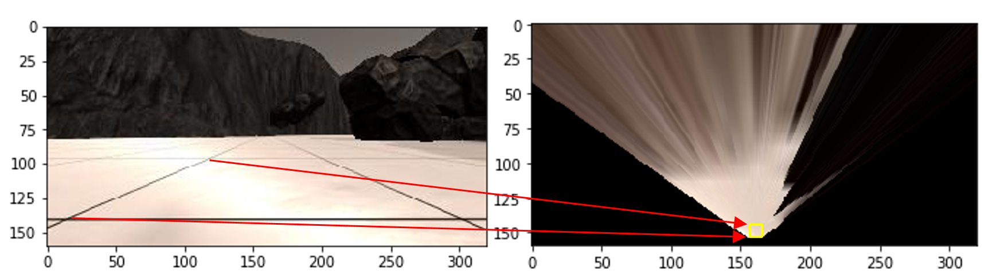
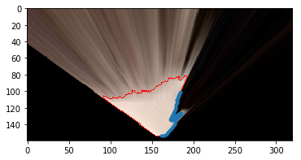

## Project: Search and Sample Return
### Project 1 For Udacity Robotics Nanodegree program

**Introduction**

The search and sample return project is based on the concept of a hypothetical rover mission. In the scenario, a rover is placed in a system of canyons along with obstacles and 'samples' that are represented by gold colored rocks. The contour of the canyon is closed (i.e. the environment is finite) and is pirmarily composed of 3 types of structures:

 * The canyon floor, which can best be described as (mostly) firm sand colored surface.
 * The canyon walls, which are typically angled away from teh floor at 10 - 20 degrees from the vertical and are primarily dark brown or black in color
 * The obsidian colored boulders placed in various areas, either as part of the canyon walls, or in the middle of the canyon floor.

The first goal of this project is to process the images from the camera on the front of the rover to both map the region and provide the navigation inputs to the rover. The second goal consists of modifying the existing rover logic so that the outputs (speed, direction) of the rover are correctly set based on the vision derived inputs to succssfully navigate the canyon environment. 

Minimum criteria for success are as follows:

 1. Map 40% or more of the environment 
 2. The map must have a fidelity of at least 60% (the map may contain no more than 40% of it's pixels that do not match the source of truth)
 3. The Rover must locate at least one of the sample rocks and map it.
 
 In addition to the minimum passing requiremenents, aspirational goals may include:
 
 4. Mapping to a higher fidelity.
 5. Develop capability for rover to autonomously correct when stuck.
 6. Picking up samples as well as locating them.
 7. Returning to the starting point once all the samples are collected.
 
For this submission, the minimum criteria were met, and an attepmt was made on the aspirational goals 4,5,6. An attempt was not made to return the rover back to its start position (#7).
 
 **Training / Calibration**

As mentioned above, the first goal for this project is to process the images for the front facing rover camera to extract mapping and navigational data. To do this, the following processing steps are applied to each image from the rover camera. The simulation was run on an Dell Lattitude E7420 on the 'Fastest' setting at resolution of 1360x768. Running the processing script in the Anaconda RoboND environment at these settings yielded between 17-24 images to be processed per second.

 ***Perform a perspective transform***
 
 The default image read in from the rover telemetry is taken from the POV of the front of the rover. To use the image for mapping the image would ideally be an isometric overhead projection. The OpenCV image processing library has two functions that can be utilized to transform the raw rover image into an isometric projectcion. The first function,[getPerspectiveTransform](https://docs.opencv.org/2.4/modules/imgproc/doc/geometric_transformations.html#getperspectivetransform) is used to determine the perspective transform, given 4 sets of coordinates that identify the same spatial locations in both the dessired source and destination.  image. Once the perspective transform is obtained, it can then be used to transform the images fed in from the rover telemetry using tje [warpPerspective function](https://docs.opencv.org/2.4/modules/imgproc/doc/geometric_transformations.html#warpperspective). An example of how this conceptually works (not to scale) is shown below:
 
 
 ***Color Thresholding***
 
 Once the transformed (warped) image is obtained, the next step is to successfully determine the navigable / unavigable areas of the canyons. The approach used here was to use an rgb threshold to identify navigable pixels since the canyon floors are larglely a light color and the unavigable terrain is mostly dark in coloring. Good results were returned when using thresholds for red, green, blue of (190,180,160). The un-navigable terrain was assumed to be all the pixels that were not above the threshold. For identifying the gold sample rocks a slighly different approach needed to be used since a simple threshold could not be used to identify specific colors. This was addressed by adding the functionality to the color_thresh function to filter on pixels that were within a tolerance of a given color value. For the gold rocks rgb values of (185, 140, 15) with a tolerance of +/- 40 for each value to return true as a match. The images below represent the raw warped image, the initial thresholding step, and then the inverse step to identify obstacle pixels:
 
 [Color Thresholding Step](thresholding.png)

```python
 def color_thresh(img, rgb_thresh=(160, 160, 160), tgt=False, tol=(40,40,40)):
    # img                  transformed (warped) camera image array
    # rgb_thresh           tgt==False (default) return array where > rgb_thresh = True (1)
    #                      tgt==True  return array where rgb_thresh +/- rgb_thresh * tol = True (1)
    # tol                  when tgt==True, sets the tolerance +/- for a pixel to return true
    
    # Create an array of zeros same xy size as img, but single channel
    color_select = np.zeros_like(img[:,:,0])
    
    # if tgt == True we are looking for samples so look for +/- from rgb_thresh
    if tgt:
        bool_array = (abs(img[:,:,0] - rgb_thresh[0]) < tol[0]) \
                   & (abs(img[:,:,1] - rgb_thresh[1]) < tol[1]) \
                   & (abs(img[:,:,2] - rgb_thresh[2]) < tol[2]) 
    
    # tgt is false, we are looking for nav terrain/obstacles
    else:    
        # Require that each pixel be above all three threshold values in RGB
        # above_thresh will now contain a boolean array with "True"
        # where threshold was met
        bool_array = (img[:,:,0] > rgb_thresh[0]) \
                   & (img[:,:,1] > rgb_thresh[1]) \
                   & (img[:,:,2] > rgb_thresh[2])
    # Index the array of zeros with the boolean array and set to 1
    color_select[bool_array] = 1
    # Return the binary image
    return color_select
``` 
 ***Contours (Not part of core submission requirments)***

In an attempt to make the rover a wall crawler it seemed that one approach would be to locate the interface between the canyon wall and the sandy floor and use that for guidance. To that end functionality to detect contours was added to the perception module. The contours are extracted from the image using the OpenCV function [findContours](https://docs.opencv.org/2.4/modules/imgproc/doc/structural_analysis_and_shape_descriptors.html#findcontours). Since the result contains multiple contours, the largest one is extracted as one most likely to be of interest for wall navigation. Once this is complete a final step of masking off parts of the contour immediately to the right of the rover is performed. The a sample result of the contours, overlayed on the source image is shown below. The blue section represents to portion of the contour used for navigating along the wall. The contour information is also updated in real time on the rover Hud with the region of interest highlighted in yellow.

 
 
  ```python
    def get_contours(img, rgb_thresh=(170, 170, 170)):

    # get_contours finds all the contours present in the warped image. 
    # with the goal being to find edge between the sand and teh wall.
    # img:           wapred camera image
    # rgb_thresh:    threshold for determing sand / not sand
    
    # Create an array of zeros same xy size as img, but single channel
    thresh_img = np.zeros_like(img[:,:,0])
    # make a copy for finding contours
    imgray = np.copy(img)
    # Require that each pixel be above 2 of the three threshold values in RGB
    # above_thresh will now contain a boolean array with 0-3. 
    above_thresh = (img[:,:,0] > rgb_thresh[0]).astype(int) + \
                   (img[:,:,1] > rgb_thresh[1]).astype(int) + \
                   (img[:,:,2] > rgb_thresh[2]).astype(int)
    
    # create the selection mask where above_thresh is used to select pixels where at least
    # 2 of 3 RGB channels are above threshold
    color_select = (above_thresh > 1).astype(int)
    
    # assign all elements in thresh_img wehre color_select = 1, to 255
    thresh_img[color_select] = 255
    
    #convert contour image to grayscale
    imgray = cv2.cvtColor(imgray,cv2.COLOR_RGB2GRAY) 
    
    # convert grayscale image for contours to binary image, return imbin as binary image 
    (thresh, imbin) = cv2.threshold(imgray, np.average(rgb_thresh).astype(int), 255, cv2.THRESH_BINARY)
    
    # make a copy (imcont) of the binary image for finding the contours since cv2.findcontours wil modify
    # our source (imbin)
    imcont = np.copy(imbin)
    
    # find the contours, imcont is modified, contours is a list of coordiantes of our contour.
    # the CHAIN_APPROX_NONE ensures we get all points without compression/ extrapolation.
    # hierarchy returns nested contour heirarchies, which we aren't using
    imcont, contours, hierarchy = cv2.findContours(imcont,cv2.RETR_TREE,cv2.CHAIN_APPROX_NONE)
    return color_select, imbin, contours
```


***Collision ROI-Region of Interest (Not part of core submission requirments)***
 
 Although the results of navigating off of the navigable pixels was good, and augmenting that with the wall pixels was better, there were still times when the rover would run into obstacles in it's path. A fully developed approach to address this would have been to build a model for avoiding collisions using the data stored in the world map and planning routes around obstacles. However, a more trivial approach was leveraged that improves the performance avoiding collisions without the complication of developing such a model. The approach used here is to select a small area (20px wide x 20px deep) in front of the rover and use it to detect obstacles in real time. The decision script then uses this information to take action in an attempt to avoid a collision. The primary drawback to this approach is that the camera on the rover has a FOV that can not see obstacles immediately to the side, or above the rover. So while this addition yielded an improvement, there are many locations in the environment where the rover has a clear FOV (no obstacles), but can still collide with or get hung up on obstacles.

***Transforming image pixels to rover centric coordinates***

It is desirable to have a reference frame that puts the rover at the center of the coordinate system in many scenarios especially with respect to making navigation decisions. To that end, a pair of functions that takes in the x and y coordinates of the navigable pixels and transforms the coordinates to rover- centric was developed. Two functions are used because in addition to transforming the coordinate system to a rover-centric one the function also converts the source image from a 160x320 binary array to a list of x, and and list of y coordinates that correlate the nonzero pixels in that array. By breaking these tasks apart, I was able to re-use the coordinate transformation portion for the contours as well.

***Converting rover centric to world reference frame**

Ultimately, the feed from the rover telemetry camera needs to be overlayed / added to a fixed ground map that rationalizes the rovers current position and yaw. This will ensure the rover centric map is stitched together correctly as the rover explores the environment. To do this, a  coordinate system rotation, translation, and scaling is performed on the rover-centric polar coordinats such that the rovers current POV is correctly mapped to the fixed world frame. This requires pulling in the rover telemetry readings for yaw, and world position as the global refernce points.

Once the pixel list in world cordinates is determined, the obvious next step would be to update the world map. However, it became obvous early on that the rover is subject to a lot of tilting and yawing motion as it accelerates, decelerates, turns and encounters obstacles. Since the camera is fixed to the front of the rover, this results in pixels being mapped to their wrong locations in world coordinates. As a thought experiment, one can imagine what would happen if the rover tilted forward so far that the camera could see nothing but navigable terrain (canyon floor) with the walls being outside of view. The resulting 'completely navigable' image returned by the rover would be mapped to the world map as navigable area since rover orientation is not being accounted for. A sophisticated approach would be to use the roll and pitch of the rover to influence the transformations and adjust on the fly to account for them. Instead of this, a simpler approach was taken which disregards mapping data when the pitch and yaw are out of tolerance for quality mapping data. The downside of this approach is that it does slow mapping somewhat, although allowing much higher fidelities, typically in the range of 94% - 97%. 


***Converting rover centric coordinates to polar coordinates***

Since the rover navigation will be done in large part by determining the azimuth to the best navigable terrain and the wall boundary, it is useful to have the rover centric coordinates in polar form rather than cartestian. This was accomplished using trigonometric relations for conversion as shown below in the code. As part of the basic project requirements, conversion is done on the cartesian pixel sets for the color threshed canyon floor pixels, the wall/floor boundary contour pixels, and the gold sample pixels:


9:46:40


